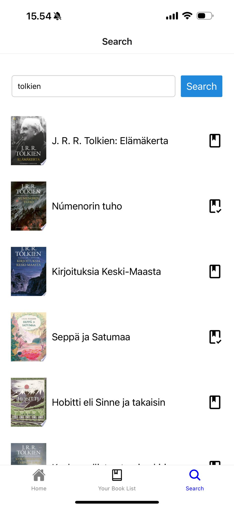
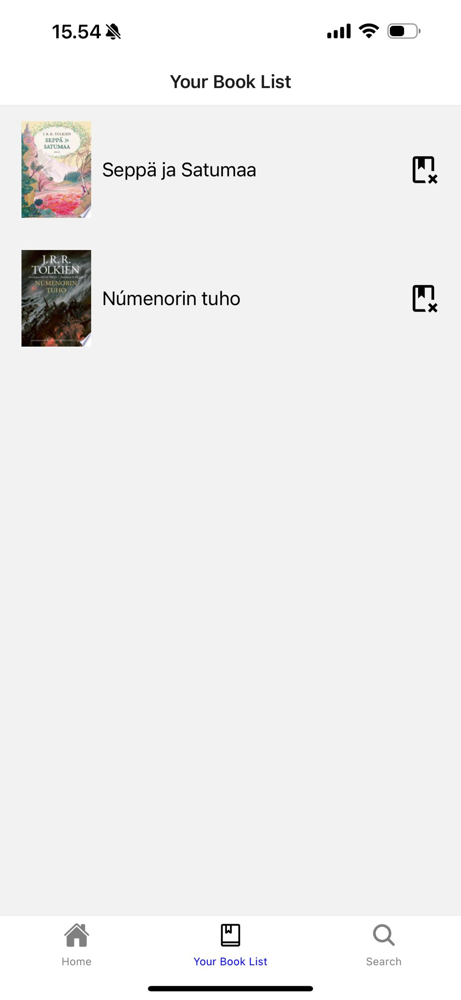
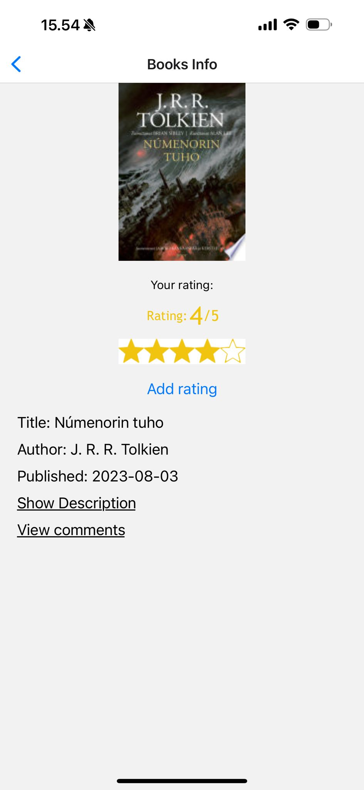
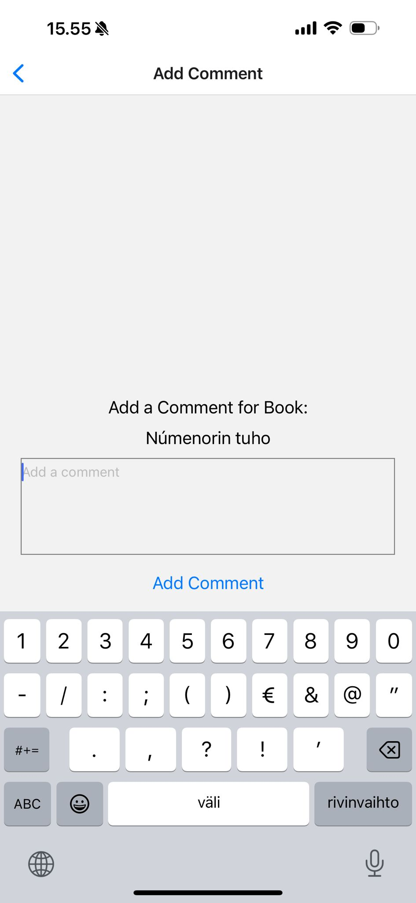
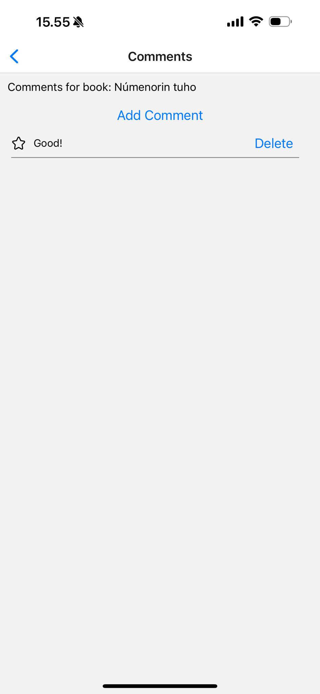

###  MyRead
A book app where users can save books, rate them with stars, write reviews, and read reviews from others.

###  Used technologies
- JavaScript
- React Native, EXPO
- Firebase Firestore Database
- Firebase Authentication
- Google Books API
- React Native Elements

### Screenshots

